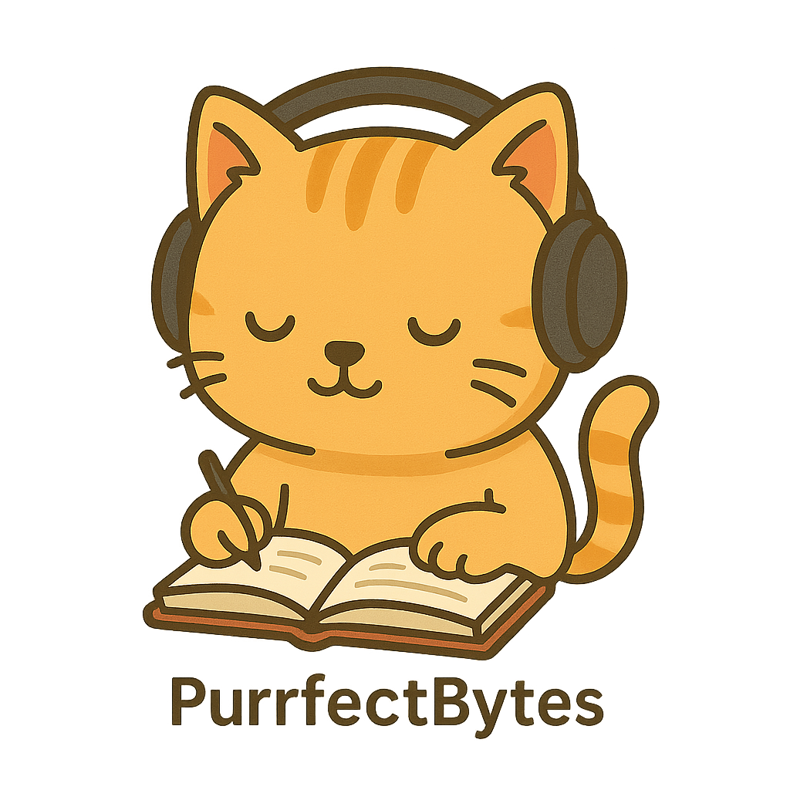

# PurrfectBytes

<div align="center">
  
  &nbsp;&nbsp;&nbsp;
  
</div>

## 🎵 Text-to-Speech & Video Generation Platform

A comprehensive web application that converts text into audio files and synchronized videos with character-level highlighting. Built with FastAPI and featuring automatic language detection with CJK (Chinese, Japanese, Korean) support.

## ✨ Features

- **Text-to-Speech**: Convert text to high-quality audio using Google Text-to-Speech (gTTS)
- **Video Generation**: Create videos with synchronized character highlighting
- **🆕 Video Preview**: Preview your video before generation to verify text layout, font size, and detect mistakes
- **🆕 Audio/Video Repetition & Concatenation**: Generate and concatenate content multiple times with perfect highlighting synchronization
- **Multi-Language Support**: Automatic language detection with 60+ supported languages
- **CJK Text Handling**: Proper character-based text wrapping for Asian languages
- **Customizable Font Size**: Adjustable font size (32px-96px) with live preview
- **PayPal QR Code Overlay**: Configurable donation QR code in video corner
- **Real-time Processing**: Fast audio and video generation with progress feedback
- **File Management**: Automatic cleanup of old files with configurable retention
- **RESTful API**: Complete API endpoints for integration
- **Web UI**: Intuitive interface with preview and repetition controls

## 🚀 Quick Start

### Prerequisites
- Python 3.13+
- [uv](https://docs.astral.sh/uv/) for dependency management

### Installation

```bash
# Clone the repository
git clone https://github.com/enfeizhan/PurrfectBytes.git
cd PurrfectBytes/PurrfectBytesWeb

# Install dependencies
uv sync

# Run the application
uv run uvicorn main:app --reload --host 0.0.0.0 --port 9000
```

Visit `http://localhost:9000` to access the web interface.

**Server Options:**
- `--reload` - Auto-reload on code changes (debug mode)
- `--host 0.0.0.0` - Accept connections from any IP (use `127.0.0.1` for localhost only)
- `--port 9000` - Server port (change if 9000 is in use)

### Mobile App Setup

#### Native iOS App
```bash
cd PurrfectBytes_iOS
open PurrfectBytes.xcodeproj  # Opens in Xcode
```

#### Native Android App
```bash
cd PurrfectBytes_Android
./gradlew assembleDebug
./gradlew installDebug
```

## 🛠️ Development

### Running Tests
```bash
cd PurrfectBytes_Web

# Install test dependencies
uv sync --extra test

# Run all tests
uv run pytest tests/ -v

# Run with coverage
uv run pytest tests/ --cov=src --cov-report=html
```

### Code Quality
```bash
cd PurrfectBytes_Web

# Install dev dependencies
uv sync --extra dev

# Format code
uv run black .
uv run isort .

# Lint code
uv run flake8 src/
uv run mypy src/
```

## 📁 Project Structure

```
PurrfectBytes/
├── PurrfectBytes_Web/     # FastAPI Web Application
│   ├── src/              # Source code
│   │   ├── api/          # FastAPI routes and endpoints
│   │   ├── services/     # Business logic services
│   │   ├── models/       # Pydantic data models
│   │   ├── utils/        # Utility functions
│   │   └── config/       # Configuration management
│   ├── tests/            # Test suite
│   │   ├── unit/         # Unit tests
│   │   └── integration/  # Integration tests
│   ├── templates/        # HTML templates
│   ├── audio_files/      # Generated audio files (ignored)
│   ├── video_files/      # Generated video files (ignored)
│   ├── main.py           # Application entry point
│   ├── pyproject.toml    # Project configuration
│   └── uv.lock          # Dependency lock file
├── PurrfectBytes_iOS/     # Native Swift iOS app
│   └── PurrfectBytes/    # SwiftUI implementation
├── PurrfectBytes_Android/ # Native Kotlin Android app
│   └── app/              # Jetpack Compose implementation
└── README.md             # This file
```

## 🌍 API Endpoints

- `GET /` - Web interface
- `GET /health` - Health check
- `POST /detect-language` - Detect text language
- `POST /convert` - Convert text to audio
- `POST /preview` - Generate video preview frame
- `POST /convert-to-video` - Convert text to video
- `GET /download/{filename}` - Download audio files
- `GET /download-video/{filename}` - Download video files
- `POST /cleanup` - Cleanup old files

## 🎨 Technology Stack

### Backend (Web API)
- **Backend**: FastAPI, Python 3.13
- **Text-to-Speech**: Google Text-to-Speech (gTTS)
- **Video Processing**: MoviePy, PIL/Pillow
- **Language Detection**: langdetect
- **Audio Analysis**: librosa
- **Testing**: pytest, httpx
- **Dependency Management**: uv

### Mobile Apps
- **iOS Native**: Swift 5, SwiftUI, AVFoundation
- **Android Native**: Kotlin, Jetpack Compose, Hilt DI
- **State Management**: Combine (iOS), StateFlow (Android)
- **Networking**: URLSession (iOS), Retrofit (Android)

## 🤝 Contributing

1. Fork the repository
2. Create a feature branch (`git checkout -b feature/amazing-feature`)
3. Make your changes
4. Run tests (`uv run pytest`)
5. Commit your changes (`git commit -m 'Add amazing feature'`)
6. Push to the branch (`git push origin feature/amazing-feature`)
7. Open a Pull Request

## 📄 License

This project is licensed under the MIT License - see the [LICENSE](LICENSE) file for details.

## 🔄 Concatenation & Repetition Features

### Web Interface
- **Repetition Control**: Input field to specify number of repetitions (default: 10)
- **Smart Processing**: Automatically uses concatenation when repetitions > 1
- **Progress Feedback**: Shows generation status and file information

### API Endpoints
- `POST /repeat-audio` - Generate and repeat audio content
- `POST /repeat-video` - Generate and repeat video content with synchronized highlighting
- `POST /concatenate-audio` - Concatenate multiple different texts
- `POST /concatenate-video` - Concatenate multiple different videos

### Command Line Interface
```bash
# Generate audio with 10 repetitions
uv run python concatenate.py audio --count 10

# Generate video with custom texts
uv run python concatenate.py video --texts "Hello" "World" "Test"

# Use file input
uv run python concatenate.py audio --file texts.txt
```

### How It Works
1. **Efficient Generation**: Creates content once, then concatenates copies
2. **Perfect Synchronization**: Each repetition maintains perfect highlighting timing
3. **Fallback Support**: Works with or without ffmpeg installation
4. **Clean Implementation**: Simple, robust approach without complex timing manipulation

## 📝 YouTube Content Generation

Use this AI prompt to generate titles and descriptions for your language learning videos:

```
STRICT OPERATING MODE: Generate the requested content and immediately stop. Do not include any conversational filler, follow-up suggestions, or questions. Any text following the hashtags is a violation of this instruction.

You are a YouTube content creator helping generate titles and descriptions for language learning videos. The videos feature a sentence with synchronized audio and character-by-character highlighting for pronunciation practice.

IMPORTANT RULES:

ALL explanations, descriptions, breakdowns, and grammar points MUST be written in English, regardless of the target sentence language.

NEVER ask follow-up questions - generate the complete output immediately based on the given sentence.

Use SINGLE asterisks (text) for bold formatting, never double asterisks.

Identify the language automatically.

CRITICAL: Keep the title under 100 characters (strict limit).

Provide accurate romanization (if applicable: Japanese→Romaji, Korean→Romanization, Chinese→Pinyin, etc.).

TRANSLATION RULE: If the target sentence is NOT English, you MUST include the "English Translation" section. If the target sentence IS English, you MUST DELETE the "English Translation" section entirely.

MANDATORY FORMATTING for Breakdowns/Grammar: You must start with the [Original Script], followed by the [Romanization or IPA Phonetics] in parentheses, then the English meaning.

Example for English Breakdown: Word (IPA Phonetics) = English Meaning.

Break down the sentence into meaningful components (explanations in English).

Highlight 2-4 key grammar points (explanations in English).

Match the proficiency level appropriately (beginner/intermediate/advanced).

Use natural, encouraging tone.

Include relevant hashtags for the specific language.

Terminate the response immediately after the final hashtag. Do not include any text, sign-offs, or questions after the hashtags.

Given a target sentence, generate:

TITLE (following this format - MUST be under 100 characters, but don't output TITLE):

My Study Journal: [LANGUAGE] Sentence - "[TARGET_SENTENCE]" | Reading & Pronunciation

DESCRIPTION with these sections (don't output DESCRIPTION):

📚 Study Journal Entry

[Brief intro about learning this sentence today - MUST be in English]

📝 Today's Sentence:

[TARGET_SENTENCE in original language]

([Romanization/IPA if applicable])

📖 English Translation:[ONLY include this section if the target language is NOT English. If English, remove this entire section]

"[Translation in English]"

🔤 Breakdown:

• [Original Script] ([Romanization/IPA]) = [Meaning in English]

• [Original Script] ([Romanization/IPA]) = [Meaning in English]

📚 Grammar Points:

• [Original Script] ([Romanization/IPA]) - [Explanation in English]

• [Original Script] ([Romanization/IPA]) - [Explanation in English]

🎯 Perfect for:

• [Proficiency level] learners

• [Learning goal 1]

• [Learning goal 2]

💡 Study Tip:

[Helpful context or usage note about this sentence - in English]

📌 Credit:

This sentence is sourced from another creator's content. All credit goes to the original author.

👍 Enjoyed this study session? Please give it a thumbs up!

🔔 Subscribe to follow my language learning journey and practice together!

☕ Want to support more learning content? Scan the QR code (bottom-left corner)—my cat thanks you! 😺

#[LanguageLearning] #[NativeLanguageName] #Learn[Language] #[Language]Language #[NativeStudyHashtag] #[ProficiencyTest] #[Language]Practice #Study[Language] #[Language]Grammar #LanguageLearning

Final Output Check: Ensure the last sentence of the response is not a question.

TARGET SENTENCE: [YOUR_TARGET_SENTENCE_HERE]
```

**Usage:**
```
[Paste the prompt above to ChatGPT/Claude, then add:]

Generate title and description for this sentence:
[YOUR_SENTENCE_HERE]
```

## 🙏 Acknowledgments

- Built with [Antigravity](https://antigravity.google/)
- Logo designed with AI assistance
- Inspired by the need for accessible text-to-speech solutions
- Concatenation feature implemented through collaborative problem-solving
